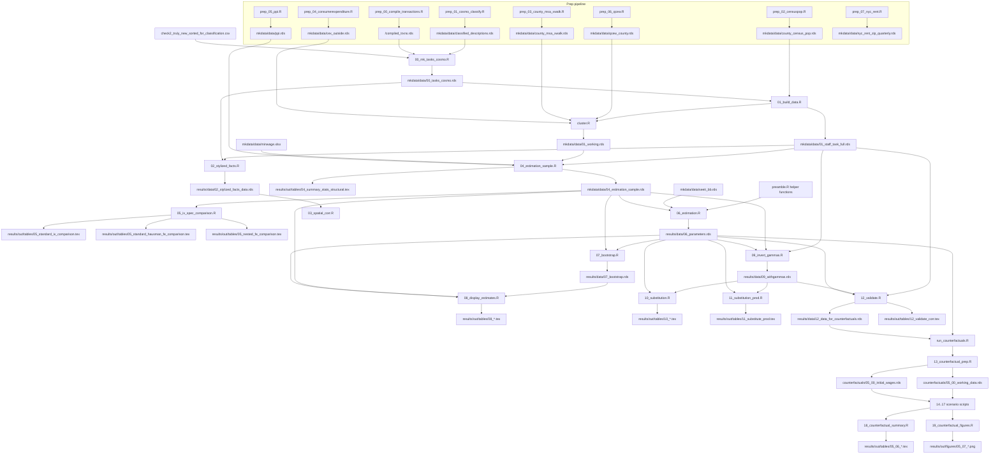

# Data Dependencies

This note documents the active end-to-end dependency graph for the current
pipeline.

## Architecture Summary

The main data split is explicit:

- `01_build_data.R` writes both:
  - `mkdata/data/01_staff_task_full.rds` for full-sample descriptive work
  - `mkdata/data/01_working.rds` for the estimation-base branch
- `04_estimation_sample.R` takes the estimation-base branch and adds
  estimation-only enrichments such as PPI, minimum wages, and instruments
- `02_stylized_facts.R` and `03_spatial_corr.R` stay on the full-sample
  descriptive branch
- `07_bootstrap.R` through `12_validate.R` produce post-estimation artifacts
  (bootstrap draws, display tables, inverted gammas, substitution patterns,
  validation outputs, and the counterfactual input `12_data_for_counterfactuals.rds`)
- `run_counterfactuals.R` orchestrates the `13_*.R` through `19_*.R` scenario
  scripts on top of `results/data/06_parameters.rds`

## Flowchart

## Current Managed Workflow

### Prep runner: `run_prep_data.R`

| Step | Script | Primary output |
|------|--------|----------------|
| 00 | `prep_00_compile_transactions.R` | `<raw_data_base>/compiled_trxns.rds` |
| 01 | `prep_01_cosmo_classify.R` | `mkdata/data/classified_descriptions.rds` |
| 02 | `prep_02_censuspop.R` | `mkdata/data/county_census_pop.rds` |
| 03 | `prep_03_county_msa_xwalk.R` | `mkdata/data/county_msa_xwalk.rds` |
| 04 | `prep_04_consumerexpenditure.R` | `mkdata/data/cex_outside.rds` |
| 05 | `prep_05_ppi.R` | `mkdata/data/ppi.rds` |
| 06 | `prep_06_qcew.R` | `mkdata/data/qcew_county.rds` |
| 07 | `prep_07_nyc_rent.R` | `mkdata/data/nyc_rent_zip_quarterly.rds` |

### Main runner: `run_all.R`

| Step | Script or component | Primary output |
|------|---------------------|----------------|
| 0 | `00_mk_tasks_cosmo.R` | `mkdata/data/00_tasks_cosmo.rds` |
| 1 | package restore/setup inside `run_all.R` | local `renv` library state |
| 2 | `01_build_data.R` + `cluster.R` | `mkdata/data/01_staff_task_full.rds`, `mkdata/data/01_working.rds` |
| 3 | `04_estimation_sample.R` | `mkdata/data/04_estimation_sample.rds`, `results/out/tables/04_summary_stats_structural.tex` |
| 4 | `05_iv_spec_comparison.R` | `results/out/tables/05_standard_iv_comparison.tex`, `results/out/tables/05_standard_hausman_fe_comparison.tex`, `results/out/tables/05_nested_fe_comparison.tex` |
| 5 | `06_estimation.R` + `preamble.R` | `results/data/06_parameters.rds` |
| 6 | `07_bootstrap.R` | `results/data/07_bootstrap.rds`, `results/data/07_boot_weights.rds` |
| 7 | `08_display_estimates.R` | `results/out/tables/08_org_price.tex`, `results/out/tables/08_time_effects.tex`, `results/out/tables/08_model_fit.tex`, `results/out/tables/08_wages_skills_<county>.tex` |
| 8 | `09_invert_gammas.R` | `results/data/09_withgammas.rds`, `results/out/figures/09_gamma_dist.png` |
| 9 | `10_substitution.R` | `results/out/tables/10_substitute.tex`, `results/out/figures/10_*.png` |
| 10 | `11_substitution_prod.R` | `results/out/tables/11_substitute_prod.tex` |
| 11 | `12_validate.R` | `results/data/12_data_for_counterfactuals.rds`, `results/out/tables/12_validate_corr.tex`, `results/out/figures/12_*.png` |
| 12 | `run_counterfactuals.R` | see counterfactual runner below |

### Counterfactual runner: `run_counterfactuals.R`

Orchestrates the `13_*.R` through `19_*.R` scenario scripts on top of
`results/data/06_parameters.rds` and `results/data/12_data_for_counterfactuals.rds`.
Shared helpers live in `utils/counterfactuals_core.R`.

| Step | Script | Primary output |
|------|--------|----------------|
| CF 00 | `13_counterfactual_prep.R` | `counterfactuals/05_00_initial_wages.rds`, `counterfactuals/05_00_working_data.rds` |
| CF 02 | `14_counterfactual_diffusion.R` | `counterfactuals/05_02_wages_diffusion.rds`, `counterfactuals/05_02_prod_diffusion.rds` |
| CF 03 | `15_counterfactual_sales_tax.R` | `counterfactuals/05_03_wages_salestax.rds`, `counterfactuals/05_03_prod_salestax.rds`, `counterfactuals/05_03_prod_initial.rds` |
| CF 04 | `16_counterfactual_immigration.R` | `counterfactuals/05_04_wages_immigration.rds`, `counterfactuals/05_04_prod_immigration.rds` |
| CF 06A | `17_counterfactual_merger.R` | `counterfactuals/05_06_wages_merger.rds`, `counterfactuals/05_06_prod_merger.rds` |
| CF 06B | `18_counterfactual_summary.R` | `results/out/tables/05_06_tot_counterfactuals.tex`, `results/out/tables/05_06_bytype_counterfactuals.tex` |
| CF 07 | `19_counterfactual_figures.R` | `results/out/figures/05_07_*.png` |

## Standalone Analysis Scripts

These scripts remain standalone by design. They operate on the descriptive,
full-sample branch rather than the estimation-only branch.

| Script | Main input | Main output |
|--------|------------|-------------|
| `02_stylized_facts.R` | `mkdata/data/00_tasks_cosmo.rds`, `mkdata/data/01_staff_task_full.rds` | `results/data/02_stylized_facts_data.rds` plus tables and figures |
| `03_spatial_corr.R` | `results/data/02_stylized_facts_data.rds` | `results/out/figures/03_spatial_cor_*.png`, `03_coverage.png` |

## Archived Non-Pipeline Scripts

One-off diagnostics are kept in `archive/experimental/`. They are not part of
the managed workflow.
