# Data Dependencies

This note documents the active end-to-end dependency graph for the current
pipeline.

## Architecture Summary

The main data split is explicit:

- `01_build_data.R` writes both:
  - `mkdata/data/01_staff_task_full.rds` for full-sample descriptive work
  - `mkdata/data/01_working.rds` for the estimation-base branch
- `04_estimation_sample.R` takes the estimation-base branch and adds
  estimation-only enrichments such as PPI, minimum wages, the
  `dye_instrument`, and the constrained-IV inputs (see
  `utils/constrained_demand_iv.R`)
- `02_stylized_facts.R` and `03_spatial_corr.R` stay on the full-sample
  descriptive branch
- `06c_wage_identification.R` runs after estimation as a lightweight
  wage-stage Hessian + perturbation diagnostic
- `07_vcov.R` through `12_validate.R` produce post-estimation artifacts
  (standard-error vcovs, display tables, inverted gammas, substitution patterns,
  validation outputs, and the counterfactual input `12_data_for_counterfactuals.rds`)
- `run_counterfactuals.R` orchestrates the `13_*.R` through `19_*.R` scenario
  scripts on top of `results/data/06_parameters.rds` and
  `results/data/12_data_for_counterfactuals.rds`

## Flowchart

```mermaid
flowchart TD
    subgraph PREP[Prep pipeline]
        p00[prep_00_compile_transactions.R] --> compiled[<raw_data_base>/compiled_trxns.rds]
        p01[prep_01_cosmo_classify.R] --> classified[mkdata/data/classified_descriptions.rds]
        p02[prep_02_censuspop.R] --> census[mkdata/data/county_census_pop.rds]
        p03[prep_03_county_msa_xwalk.R] --> msa[mkdata/data/county_msa_xwalk.rds]
        p04[prep_04_consumerexpenditure.R] --> cex[mkdata/data/cex_outside.rds]
        p05[prep_05_ppi.R] --> ppi[mkdata/data/ppi.rds]
        p06[prep_06_qcew.R] --> qcew[mkdata/data/qcew_county.rds]
    end

    reviewed[check2_truly_new_sorted_for_classification.csv] --> mk
    compiled --> mk[00_mk_tasks_cosmo.R]
    classified --> mk
    mk --> tasks[mkdata/data/00_tasks_cosmo.rds]

    tasks --> build[01_build_data.R]
    census --> build
    cex --> cluster[cluster.R]
    msa --> cluster
    qcew --> cluster
    build --> cluster

    build --> stafffull[mkdata/data/01_staff_task_full.rds]
    cluster --> working[mkdata/data/01_working.rds]

    ppi --> esample[04_estimation_sample.R]
    minwage[mkdata/data/minwage.xlsx] --> esample
    working --> esample
    stafffull --> esample
    esample --> esample_out[mkdata/data/04_estimation_sample.rds]
    esample --> summary04[results/out/tables/04_summary_stats_structural.tex]

    esample_out --> ivspec[05_iv_spec_comparison.R]
    ivspec --> iv1[results/out/tables/05_standard_iv_comparison.tex]
    ivspec --> iv2[results/out/tables/05_standard_hausman_fe_comparison.tex]
    ivspec --> iv2b[results/out/tables/05_standard_dye_fe_comparison.tex]
    ivspec --> iv3[results/out/tables/05_nested_fe_comparison.tex]
    ivspec --> iv4[results/out/tables/05_nested_sigma_eq_one.tex]
    ivspec --> iv1fs[results/out/tables/05_standard_iv_comparison_first_stage.tex]
    ivspec --> iv2fs[results/out/tables/05_standard_hausman_fe_comparison_first_stage.tex]
    ivspec --> iv2bfs[results/out/tables/05_standard_dye_fe_comparison_first_stage.tex]

    esample_out --> est[06_estimation.R]
    starts[mkdata/data/seeit_bb.rds] --> est
    preamble[preamble.R helper functions] --> est
    est --> params[results/data/06_parameters.rds]

    tasks --> a02[02_stylized_facts.R]
    stafffull --> a02
    a02 --> a02out[results/data/02_stylized_facts_data.rds]
    a02out --> a03[03_spatial_corr.R]

    esample_out --> vcov[07_vcov.R]
    params --> vcov
    vcov --> fsout[results/data/07_first_stage_vcov.rds]
    vcov --> mtout[results/data/07_murphy_topel_vcov.rds]

    params --> disp[08_display_estimates.R]
    esample_out --> disp
    fsout --> disp
    mtout --> disp
    disp --> disptabs[results/out/tables/08_*.tex]

    params --> gam[09_invert_gammas.R]
    esample_out --> gam
    stafffull --> gam
    gam --> gamout[results/data/09_withgammas.rds]

    params --> val[12_validate.R]
    gamout --> val
    stafffull --> val
    val --> valout[results/data/12_data_for_counterfactuals.rds]
    val --> valtabs[results/out/tables/12_validate_corr.tex]

    valout --> cf[run_counterfactuals.R]
    params --> cf
    cf --> cf13[13_counterfactual_prep.R]
    warmstarts[counterfactuals/13_warm_start_wages.rds] --> cf13
    cf13 --> cfwages[counterfactuals/13_initial_wages.rds]
    cf13 --> cfdata[counterfactuals/13_working_data.rds]
    cf13 --> cflab[counterfactuals/13_total_labor.rds]
    cf13 --> cfprod0[counterfactuals/13_prod_initial.rds]
    cfwages --> cfscen[14..17 scenario scripts]
    cfdata --> cfscen
    cflab --> cfscen
    cfscen --> cfsum[18_counterfactual_summary.R]
    cfscen --> cfplot[19_counterfactual_figures.R]
    cfsum --> cftables[results/out/tables/18_*_counterfactuals.tex]
    cfplot --> cffigs[results/out/figures/19_*.png]

    cfwages --> sub20[20_substitution.R]
    cfdata --> sub20
    params --> sub20
    sub20 --> sub20out[results/out/tables/20_substitute.tex]
    sub20 --> sub20figs[results/out/figures/20_*.png]

    cfwages --> sub21[21_substitution_prod.R]
    cfdata --> sub21
    params --> sub21
    sub21 --> sub21out[results/out/tables/21_substitute_prod.tex]
```

## Current Managed Workflow

### Prep runner: `run_prep_data.R`

| Step | Script | Primary output |
|------|--------|----------------|
| 00 | `prep_00_compile_transactions.R` | `<raw_data_base>/compiled_trxns.rds` |
| 01 | `prep_01_cosmo_classify.R` | `mkdata/data/classified_descriptions.rds` |
| 02 | `prep_02_censuspop.R` | `mkdata/data/county_census_pop.rds` |
| 03 | `prep_03_county_msa_xwalk.R` | `mkdata/data/county_msa_xwalk.rds` |
| 04 | `prep_04_consumerexpenditure.R` | `mkdata/data/cex_outside.rds` |
| 05 | `prep_05_ppi.R` | `mkdata/data/ppi.rds` |
| 06 | `prep_06_qcew.R` | `mkdata/data/qcew_county.rds` |

### Main runner: `run_all.R`

> **Where it runs:** steps `0`–`2c` (`00_mk_tasks_cosmo`, `01_build_data`,
> `02_stylized_facts`, `03_spatial_corr`) and the `prep_*` build above run
> **locally** — they need the confidential raw transaction pull and external
> geo/Census files. Steps `3`–`13` (`04_estimation_sample` → `22_skill_parameter_units`)
> run on the **Longleaf cluster** from committed inputs (parameters, warm
> starts, public-source prep outputs) plus derived firm/staff-level inputs
> transferred out-of-band — those are pseudonymized microdata and are not
> committed to the public repo (see the root README's Data Availability
> section). See `slurm_longleaf.md` §8 for the full local/cluster map, the
> out-of-band transfer list, and the reproducible cluster-run recipe.

| Step | Script or component | Primary output |
|------|---------------------|----------------|
| 0 | `00_mk_tasks_cosmo.R` | `mkdata/data/00_tasks_cosmo.rds` |
| 1 | package restore/setup inside `run_all.R` | local `renv` library state |
| 2 | `01_build_data.R` + `cluster.R` | `mkdata/data/01_staff_task_full.rds`, `mkdata/data/01_working.rds` |
| 3 | `04_estimation_sample.R` | `mkdata/data/04_estimation_sample.rds`, `results/out/tables/04_summary_stats_structural.tex` |
| 4 | `05_iv_spec_comparison.R` | `results/out/tables/05_standard_iv_comparison.tex`, `results/out/tables/05_standard_hausman_fe_comparison.tex`, `results/out/tables/05_standard_dye_fe_comparison.tex`, `results/out/tables/05_nested_fe_comparison.tex`, `results/out/tables/05_nested_sigma_eq_one.tex`, `results/out/tables/05_standard_iv_comparison_first_stage.tex`, `results/out/tables/05_standard_hausman_fe_comparison_first_stage.tex`, `results/out/tables/05_standard_dye_fe_comparison_first_stage.tex` |
| 5 | `06_estimation.R` + `preamble.R` | `results/data/06_parameters.rds` |
| 5b | `06b_estimation_monotone.R` + `utils/constrained_demand_iv.R` | `results/data/06b_parameters_monotone.rds`, `results/data/06b_perms.rds`, `results/data/06b_qp_diagnostics.rds`, `mkdata/data/06b_seeit_bb.rds` |
| 5c | `06c_wage_identification.R` | `results/data/06c_wage_identification.rds`, `results/out/tables/06c_wage_eigenvalues.tex`, `results/out/tables/06c_wage_perturbation.tex` |
| 6 | `07_vcov.R` | `results/data/07_first_stage_vcov.rds` (analytical clustered 2SLS demand vcov), `results/data/07_murphy_topel_vcov.rds` (Murphy-Topel structural sandwich). Replaces the retired `legacy/07_bootstrap.R`. |
| 7 | `08_display_estimates.R` | `results/out/tables/08_org_price.tex`, `results/out/tables/08_time_effects.tex`, `results/out/tables/08_model_fit.tex`, `results/out/tables/08_wages_skills_<county>.tex` |
| 8 | `09_invert_gammas.R` | `results/data/09_withgammas.rds`, `results/out/figures/09_gamma_dist.png` |
| 9 | `12_validate.R` | `results/data/12_data_for_counterfactuals.rds`, `results/out/tables/12_validate_corr.tex`, `results/out/figures/12_*.png` |
| 10 | `run_counterfactuals.R` | see counterfactual runner below |
| 11 | `20_substitution.R` | `results/out/tables/20_substitute.tex`, `results/out/figures/20_*.png` (wage-substitution patterns at the cleared equilibrium wages from `13_initial_wages.rds`) |
| 12 | `21_substitution_prod.R` | `results/out/tables/21_substitute_prod.tex` (productivity-substitution patterns at the cleared equilibrium wages) |
| 13 | `22_skill_parameter_units.R` | `results/out/tables/22_skill_units.tex`, `results/data/22_skill_units.csv` |

> The warm-start seeds (`results/data/counterfactuals/13_warm_start_wages.rds`
> and `14_/15_/16_/17_warm_start_wages_*.rds`) are **committed inputs**, read
> directly by the counterfactual scripts. `compile_warm_start_wages.R` (baseline)
> and `build_la_warm_start_*.R` (per-counterfactual) are **manual tools** that you
> re-run by hand to refresh those committed seeds when a better-clearing wage
> vector is found; they are intentionally **not** part of `run_all.R`.

Wage-stage post-solve escalation for `06_estimation.R` lives in
`utils/wage_fallbacks.R` (Layers 1-5: per-county polish, slice-Hessian probe,
multistart, re-PSO from improved joint vector, opt-in joint multistart). L1-L3
are enabled by default. (The `wage_fallback_skip_in_bootstrap` gate applied only
to the retired bootstrap reps; see `legacy/bootstrap_slurm.md`. Standard errors
are now the analytical Murphy-Topel sandwich from `07_vcov.R`.)

### Counterfactual runner: `run_counterfactuals.R`

Orchestrates the `13_*.R` through `19_*.R` scenario scripts on top of
`results/data/06_parameters.rds` and `results/data/12_data_for_counterfactuals.rds`.
Shared helpers live in `utils/counterfactuals_core.R`. Data artifacts land
under `results/data/counterfactuals/` and figure basenames carry the
matching `19_` prefix.

| Step | Script | Primary output |
|------|--------|----------------|
| CF 00 | `13_counterfactual_prep.R` | `counterfactuals/13_initial_wages.rds`, `counterfactuals/13_working_data.rds`, `counterfactuals/13_total_labor.rds`, `counterfactuals/13_prod_initial.rds` (warm-starts the labor-clearing solver from `counterfactuals/13_warm_start_wages.rds` if present; see `compile_warm_start_wages.R`) |
| CF 02 | `14_counterfactual_diffusion.R` | `counterfactuals/14_wages_diffusion.rds`, `counterfactuals/14_prod_diffusion.rds` |
| CF 03 | `15_counterfactual_sales_tax.R` | `counterfactuals/15_wages_salestax.rds`, `counterfactuals/15_prod_salestax.rds` |
| CF 04 | `16_counterfactual_immigration.R` | `counterfactuals/16_wages_immigration.rds`, `counterfactuals/16_prod_immigration.rds` |
| CF 06A | `17_counterfactual_merger.R` | `counterfactuals/17_wages_merger.rds`, `counterfactuals/17_prod_merger.rds` |
| CF 06B | `18_counterfactual_summary.R` | `results/out/tables/18_tot_counterfactuals.tex`, `results/out/tables/18_bytype_counterfactuals.tex` |
| CF 07 | `19_counterfactual_figures.R` | `results/out/figures/19_immigration_*.png` (8: scatter/price/marketshare/sindex × realloc/reorg), `19_merger_*.png` (6: price/marketshare/sindex × realloc/reorg) |

## Standalone Analysis Scripts

These scripts remain standalone by design. They operate on the descriptive,
full-sample branch rather than the estimation-only branch.

| Script | Main input | Main output |
|--------|------------|-------------|
| `02_stylized_facts.R` | `mkdata/data/00_tasks_cosmo.rds`, `mkdata/data/01_staff_task_full.rds` | `results/data/02_stylized_facts_data.rds` plus tables and figures |
| `03_spatial_corr.R` | `results/data/02_stylized_facts_data.rds` | `results/out/figures/03_spatial_cor_*.png`, `03_coverage.png` |
| `22_skill_parameter_units.R` | `results/data/06_parameters.rds`, `results/data/12_data_for_counterfactuals.rds` | `results/out/tables/22_*.tex` (skill matrix re-expressed in WTP-per-customer and percentage-point market-share units) |
| `compile_warm_start_wages.R` | most-recent `results/data/counterfactuals/14_*-17_*_wages_*.rds` | `results/data/counterfactuals/13_warm_start_wages_<scenario>.rds` (per-scenario warm starts consumed by 14-17) |

## Archived Non-Pipeline Scripts

One-off diagnostics are kept in `archive/experimental/`. They are not part of
the managed workflow.
